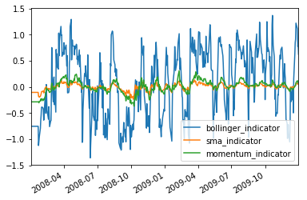
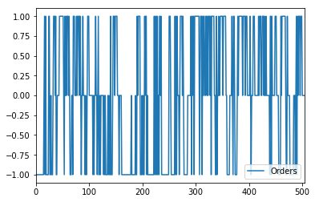
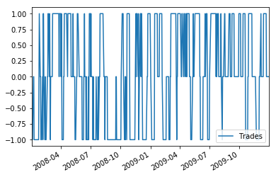
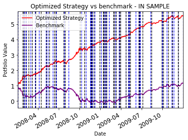

```python
# Importing necessary libraries and Code
## Following gives a description of the function of each of the imports
## util.get_data 
##    : Provides CSV files with stock market data for multiple stock symbols in US stock market
## marketsimcode.marketsim
##    : Provides a code to simulate market. This function accepts orders which contain stock orders for a particular symbol and a particular date, 
##      initial investment as "start_val", broker commission as "commission" and impact as "impact".
## RTLearner 
##    : This is a Random Decision Tree Learner with Feature selection at every node as a Random function
## BagLearner
##    : This learner calls provided learner using Bagging. We can input bag size 
## ManualStrategy
##    : This is a portfolio strategy that was created by a human by looking at the indicators and fixing their value manually.
##    : This is used for comparison with the StrategyLearner performance and returns.
import pandas as pd
from util import get_data
import datetime as dt
import matplotlib.pyplot as plt
import numpy as np
import math
import marketsimcode as marketsim
from BagLearner import BagLearner
from RTLearner import RTLearner
import ManualStrategy
```


```python
# This block defines indicators. 
def SMA(JPM_df,window):
    # Simple Moving Averages
    sma=JPM_df.rolling(window,center=False).mean()
    return sma

def bollinger(JPM_df,window):
    sigma=JPM_df.rolling(window,center=False).std()
    sma=JPM_df.rolling(window).mean()
    upper_bollinger_band=JPM_df+2*sigma
    lower_bollinger_band=JPM_df+(-2*sigma)
    bollinger_indicator=(JPM_df-sma)/(2*sigma)
    return upper_bollinger_band,lower_bollinger_band,bollinger_indicator

def momentum(JPM_df,window):
    # Momentum
    momentum=(JPM_df/JPM_df.shift(window))-1
    return momentum
```


```python
#using indicators SMA, Bollinger and momentum
symbol="AAPL"
insample_start=dt.datetime(2008, 1, 1)
insample_end=dt.datetime(2009,12,31)
outsample_start=dt.datetime(2010, 1, 1)
outsample_end=dt.datetime(2011, 12, 31)
sv = 100000
window=14
symbol_df=get_data([symbol], pd.date_range(insample_start, outsample_end))
symbol_df=symbol_df.drop(['SPY'],axis=1)
indicator_data=symbol_df.copy()
sma=SMA(indicator_data,window)
sma_indicator=(indicator_data/sma)-1
upper_bollinger,lower_bollinger,bollinger_indicator=bollinger(indicator_data,window)
momentum_indicator=momentum(indicator_data,window)
#print("SMA\n",sma_indicator,"bollinger_indicator\n",bollinger_indicator,"momentum\n",momentum_indicator)
```


```python
# Preparing training data using indicators
#Since each of the indicators are prepared with a date, 
#we can divide the indicators into training and testing date wise
#concatenate the dataframes for indicators to form the training X data
train_x_df=pd.concat([bollinger_indicator[insample_start:insample_end],
                   sma_indicator[insample_start:insample_end],
                  momentum_indicator[insample_start:insample_end]],ignore_index=False,axis=1)
train_x_df.columns=['bollinger_indicator','sma_indicator','momentum_indicator']
train_x_df=train_x_df.fillna(method='ffill')
train_x_df=train_x_df.fillna(method='bfill')
train_x_df.plot()
#df_return=pd.DataFrame(np.nan, index=symbol_df.index, columns=['Orders'])
```


    <matplotlib.axes._subplots.AxesSubplot at 0x7f9050673358>


    

    


```python
# For Training Y Data we need to observe the market on the insample dates. 
# For any given day i we need to check whether the market goes up or down on the (i+n)th day. 
# If the market goes up then our indicators should predict a BUY or +1
# If the market goes down then our indicators should predict a SELL or -1
# If the market stays the same then our indicators should predict a HOLD or 0
# Its tricky how we decide the forward looking window i.e. n and "how much" should the market go up or down 
# considering a week of data i.e. n=5 and 20% market impact
train_y_arr=[]
commission = 9.95
impact = 0.005
is_holding=True
N=5
YSELL=-0.02
YBUY=0.02
for i in range(train_x_df.shape[0]-N):
    returns=(symbol_df[symbol].iloc[i+N]/symbol_df[symbol].iloc[i])-1
    if (returns > (YBUY+impact)):
        #Price Goes up later by 20%, then BUY if not already bought
        train_y_arr.append(1)
       
    elif (returns < (YSELL-impact)):
        #Price Goes down later by 20%, then SELL
        train_y_arr.append(-1)
        is_holding=False
    else:
        train_y_arr.append(0)
train_y_arr.extend(N*[0])
train_y_df=pd.DataFrame(data=train_y_arr,index=train_x_df.index,columns=["Trades"])
```


```python
#Change the pandas DFs to numpy arrays as our learner accepts only Numpy
# They say Numpy is faster :)
train_x=train_x_df.to_numpy()
train_y=train_y_df.to_numpy()
```


```python
#AddEvidence
learner = BagLearner(learner=RTLearner, kwargs={"leaf_size": 5}, bags=30, boost=False, verbose=False)
learner.addEvidence(train_x, train_y)
```


```python
#Test
in_sample_y=pd.DataFrame(learner.query(train_x),columns=['Orders'])
in_sample_y.plot()
train_y_df.plot()
```


    <matplotlib.axes._subplots.AxesSubplot at 0x7f90b1639d30>


    

    


    

    


```python
#Prepare orders for marketsim.computeportvals
manual_orders = in_sample_y.copy()
manual_orders.iloc[0] = 1
manual_orders.iloc[-1] = -1
buy=True
for i in range(1,manual_orders.size):
    curr=manual_orders['Orders'][i]
    if curr == 1 and buy==True:
        manual_orders['Orders'][i]=0
    elif curr == -1 and buy==True:
        buy=False
    elif curr == 1 and buy==False:
        buy=True
    elif curr == -1 and buy==False:
        manual_orders['Orders'][i]=0
    elif curr not in [0,1,-1]:
        manual_orders['Orders'][i]=0
#print(manual_orders)

manual_orders.index=train_y_df.index
manual_orders.iloc[0] = 1
manual_orders.iloc[-1] = -1
manual_orders = manual_orders[(manual_orders.Orders != 0)]
manual_orders['Symbol'] = symbol
manual_orders['Order'] = np.where(manual_orders['Orders']>0, 'BUY', 'SELL')
manual_orders['Shares'] = np.where(manual_orders['Orders']>0, 2000,2000)
manual_orders['Date'] = manual_orders.index
benchmark_orders = pd.DataFrame(data={'Symbol': [symbol,symbol],'Order': ["BUY","BUY"],
                                      'Shares': [1000,0]},
                                index={train_y_df.index.min(), train_y_df.index.max()})
manual_orders['Shares'].iloc[0] = 1000
#manual_orders['Shares'].iloc[-1] = 0
benchmark_orders['Date']=benchmark_orders.index
trades=manual_orders.copy()
trades['Orders']=np.where(trades['Order']=='BUY', trades['Shares'], -trades['Shares'])
trades=trades.drop(labels=['Symbol', 'Order','Shares','Date'], axis=1)
#TODO : Clean the output of Random Forest to select only changing signals
if trades['Orders'].iloc[-1]<0:
    trades['Orders'].iloc[-1]=0
elif trades['Orders'].iloc[-1]>0:
    trades['Orders'].iloc[-1]=0
print(trades)
```

                Orders
    2008-01-02    1000
    2008-01-03   -2000
    2008-01-25    2000
    2008-01-28   -2000
    2008-01-29    2000
    2008-01-30   -2000
    2008-02-06    2000
    2008-02-08   -2000
    2008-02-20    2000
    2008-02-27   -2000
    2008-03-06    2000
    2008-03-19   -2000
    2008-03-20    2000
    2008-04-04   -2000
    2008-04-14    2000
    2008-05-05   -2000
    2008-05-08    2000
    2008-05-14   -2000
    2008-05-21    2000
    2008-06-05   -2000
    2008-06-12    2000
    2008-06-17   -2000
    2008-06-19    2000
    2008-06-20   -2000
    2008-07-23    2000
    2008-07-24   -2000
    2008-07-30    2000
    2008-08-14   -2000
    2008-10-02    2000
    2008-10-10   -2000
    ...            ...
    2009-03-25    2000
    2009-03-30   -2000
    2009-03-31    2000
    2009-04-23   -2000
    2009-04-24    2000
    2009-05-05   -2000
    2009-05-07    2000
    2009-05-08   -2000
    2009-05-13    2000
    2009-06-05   -2000
    2009-06-18    2000
    2009-06-22   -2000
    2009-06-23    2000
    2009-06-26   -2000
    2009-07-06    2000
    2009-08-10   -2000
    2009-08-14    2000
    2009-09-29   -2000
    2009-09-30    2000
    2009-10-02   -2000
    2009-10-05    2000
    2009-10-22   -2000
    2009-10-28    2000
    2009-11-11   -2000
    2009-11-13    2000
    2009-11-20   -2000
    2009-12-09    2000
    2009-12-10   -2000
    2009-12-11    2000
    2009-12-31       0
    
    [88 rows x 1 columns]


    /Users/prithviraj.pawar/opt/anaconda3/envs/ml4t/lib/python3.6/site-packages/pandas/core/indexing.py:190: SettingWithCopyWarning: 
    A value is trying to be set on a copy of a slice from a DataFrame
    
    See the caveats in the documentation: http://pandas.pydata.org/pandas-docs/stable/indexing.html#indexing-view-versus-copy
      self._setitem_with_indexer(indexer, value)


```python
commission = 9.95
impact = 0.005
manual_strategy=marketsim.compute_portvals(manual_orders, start_val=100000, commission=commission, impact=impact)
benchmark=marketsim.compute_portvals(benchmark_orders, start_val=100000, commission=commission, impact=impact)

manual_strategy=manual_strategy/manual_strategy.iloc[0]
benchmark=benchmark/benchmark.iloc[0]
ax=manual_strategy.plot(title="Optimized Strategy vs benchmark - IN SAMPLE",color="red",label="Optimized Strategy")
benchmark.plot(ax=ax,label="Benchmark",color="purple")
for date,row in manual_orders.iterrows():
    if(row['Order']=='SELL'):
        plt.axvline(x = date, color = 'blue',linewidth=1.2,linestyle="--")
    elif(row['Order']=='BUY'):
        plt.axvline(x = date, color = 'black',linewidth=1.2,linestyle="--")
ax.legend()
plt.xlabel("Date")
plt.ylabel("Potfolio Value")
plt.yticks(fontsize=12)
plt.xticks(fontsize=12)
plt.plot()
```


    []


    

    

