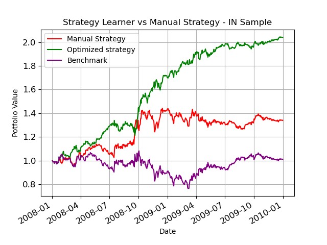

## Overview
I am building a strategy for stock market that will maximize my portfolio returns. My portfolio will have only one stock symbol at a time (JPM). The goal is to learn from the market in the past using technical analysis and then take intelligent steps in the future to increase the portfolio returns. For learning the trends of a stock I have used Random Forest learner. This learner is assisted by 3 Technical analysis indicators that will guide it to learn important trends in the market. This learner replicates the technical analysis done by humans for predicting the stock market and taking intelligent decisions to LONG and SHORT stocks.

## Assumptions and Pre-requisites
Following gives a description of the function of each of the imports

##### util.get_data()
Provides CSV files with stock market data for multiple stock symbols in US stock market

##### marketsimcode.marketsim()
Provides a code to simulate market. This function accepts orders which contain stock orders for a particular symbol and a particular date,
initial investment as "start_val", broker commission as "commission" and impact as "impact".

##### RTLearner
This is a Random Decision Tree Learner with Feature selection at every node as a Random function

##### BagLearner
This learner calls provided learner using Bagging. We can input bag size

##### The stock symbols

The stock symbols are words which represent the stock name on US stock market. Also each of the symbols must be present inside the data folder.
Stock symbol for testing and training: JPM

##### In sample Period
The in-sample period is January 1, 2008 to December 31, 2009.

##### Out sample Period
The out-of-sample/testing period is January 1, 2010 to December 31, 2011.

##### initial amount
Starting cash is $100,000.

##### commission
commission is the fixed amount in dollars charged for each transaction (both entry and exit)

##### impact
Market impact: For each trade that I execute, assume that the stock price moves against me according to the impact parameter. So, if I am buying, assume the price goes up (e.g., rises 50 bps) before your purchase. Similarly, if selling, assume the price drops (e.g., falls 50 bps) before the sale. For simplicity treat the market impact penalty as a deduction from my cash balance.
Fixed value of 0.005%

##### Positions
Allowable positions are: 1000 shares long, 1000 shares short, 0 shares

## Technical Indicators

Technical Indicators are heuristics used to analyze the stock market and its trends using historical data and trading volume. I have used the same technical indicators that I used for Manual Strategy, i.e. **Simple Moving Average, Bollinger Bands** and **Momentum**

## Random Forest

For solving this problem I used Random Forest algorithm to train on the In Sample JPM data. For this Random Forest I used a Random Decision Tree with leaf size as 5 and bagging with number of bags = 30. Bagging was used to reduce the Overfitting often introduced due to smaller leaf sizesA random forest is a bagged random decision tree.
A [decision tree](https://en.wikipedia.org/wiki/Decision_tree) is supervised learning method used in classification and regression. In our case we will use a regression tree. In a decision tree, the training data is divided among multiple nodes based on feature values. These features are located in the nodes of the tree. There can be multiple features for a data point. Based on the feature values the training sample
#### Bootstrap Aggregation (Bagging)
It is also called an [ensemble learning](https://en.wikipedia.org/wiki/Ensemble_learning) and is a way to combine two or more learning models together. It is advantageous for reducing overfitting. The basic idea is to create number of bags of data randomly selected with replacement. Replacement is to avoid repetition of same data points. Each of these bags is used as training set for the respective model. Since there are multiple models they will generate multiple predictions. Hence to select the correct prediction we take Mean or Mode of the prediction.
#### Training a Random decision tree
This is nothing but building the decision tree using the training samples. Each training sample has multiple features. While building the decision tree we need to decide the feature that will be useful for splitting the data samples. In a Random Decision tree, I am selecting the feature randomly. However in a normal decision tree there are various ways to select the feature like Correlation Coefficient, Gini impurity etc.
## Trading Problem as a learning Problem
Before starting the learning process, we need to map the trading problem as an ML problem.
For transforming this problem into a learning problem, a data pre-processing layer is used in the Strategy Learner to prepare training and testing data.
### Prepare Training and Testing data
Here, I calculated the  indicators values for a provided timeframe for a particular symbol. For each of these indicator data-frames, I used forward filling and backward filling since all my indicators are window based. This eliminated NaN values. For Training and Testing data I used indicator data-frames as X data for In-sample and Out-sample period respectively. After that I kept the raw values for X data as they were sufficient to understand trends in the data for Random Forest. For discretizing the Y data, I used the following method that converted raw stock values into [0,-1,1] based on various hyper-parameters.
***Y Train***
To prepare Y values in training phase I had to calculate market returns as follows in the In-Sample period for JPM
```python
 returns=(symbol_df[symbol].iloc[i+N]/symbol_df[symbol].iloc[i])-1
    if (returns > (YBUY+impact)):
        #Price Goes up later by 20%, then BUY if not already bought. #LONG
        train_y.append(1)

    elif (returns < (YSELL-impact)):
        #Price Goes down later by 20%, then SELL. #SHORT
        train_y.append(-1)
        is_holding=False
    else:
        train_y.append(0).
```
Here I used N=5 as 5 days future peeking window, YBUY=0.02 and YSELL=-0.02 meaning 2% returns. If returns (Y[t]) were greater or smaller, then I took a LONG or SHORT position respectively else I followed the older position. Also, I included impact into my calculation because it represents true returns expected. Finally, I converted everything into Numpy for better performance.

## Jupyter Notebook
```python
# Importing necessary libraries and Code
## Following gives a description of the function of each of the imports
## util.get_data
##    : Provides CSV files with stock market data for multiple stock symbols in US stock market
## marketsimcode.marketsim
##    : Provides a code to simulate market. This function accepts orders which contain stock orders for a particular symbol and a particular date,
##      initial investment as "start_val", broker commission as "commission" and impact as "impact".
## RTLearner
##    : This is a Random Decision Tree Learner with Feature selection at every node as a Random function
## BagLearner
##    : This learner calls provided learner using Bagging. We can input bag size
## ManualStrategy
##    : This is a portfolio strategy that was created by a human by looking at the indicators and fixing their value manually.
##    : This is used for comparison with the StrategyLearner performance and returns.
import pandas as pd
from util import get_data
import datetime as dt
import matplotlib.pyplot as plt
import numpy as np
import math
import marketsimcode as marketsim
from BagLearner import BagLearner
from RTLearner import RTLearner
import ManualStrategy
```

```python
# This block defines indicators.
def SMA(JPM_df,window):
    # Simple Moving Averages
    sma=JPM_df.rolling(window,center=False).mean()
    return sma

def bollinger(JPM_df,window):
    sigma=JPM_df.rolling(window,center=False).std()
    sma=JPM_df.rolling(window).mean()
    upper_bollinger_band=JPM_df+2*sigma
    lower_bollinger_band=JPM_df+(-2*sigma)
    bollinger_indicator=(JPM_df-sma)/(2*sigma)
    return upper_bollinger_band,lower_bollinger_band,bollinger_indicator

def momentum(JPM_df,window):
    # Momentum
    momentum=(JPM_df/JPM_df.shift(window))-1
    return momentum
```
```python
#using indicators SMA, Bollinger and momentum
symbol="AAPL"
insample_start=dt.datetime(2008, 1, 1)
insample_end=dt.datetime(2009,12,31)
outsample_start=dt.datetime(2010, 1, 1)
outsample_end=dt.datetime(2011, 12, 31)
sv = 100000
window=14
symbol_df=get_data([symbol], pd.date_range(insample_start, outsample_end))
symbol_df=symbol_df.drop(['SPY'],axis=1)
indicator_data=symbol_df.copy()
sma=SMA(indicator_data,window)
sma_indicator=(indicator_data/sma)-1
upper_bollinger,lower_bollinger,bollinger_indicator=bollinger(indicator_data,window)
momentum_indicator=momentum(indicator_data,window)
#print("SMA\n",sma_indicator,"bollinger_indicator\n",bollinger_indicator,"momentum\n",momentum_indicator)
```
```python
# Preparing training data using indicators
#Since each of the indicators are prepared with a date,
#we can divide the indicators into training and testing date wise
#concatenate the dataframes for indicators to form the training X data
train_x_df=pd.concat([bollinger_indicator[insample_start:insample_end],
                   sma_indicator[insample_start:insample_end],
                  momentum_indicator[insample_start:insample_end]],ignore_index=False,axis=1)
train_x_df.columns=['bollinger_indicator','sma_indicator','momentum_indicator']
train_x_df=train_x_df.fillna(method='ffill')
train_x_df=train_x_df.fillna(method='bfill')
train_x_df.plot()
#df_return=pd.DataFrame(np.nan, index=symbol_df.index, columns=['Orders'])
```
    <matplotlib.axes._subplots.AxesSubplot at 0x7f9050673358>


```python
# For Training Y Data we need to observe the market on the insample dates.
# For any given day i we need to check whether the market goes up or down on the (i+n)th day.
# If the market goes up then our indicators should predict a BUY or +1
# If the market goes down then our indicators should predict a SELL or -1
# If the market stays the same then our indicators should predict a HOLD or 0
# Its tricky how we decide the forward looking window i.e. n and "how much" should the market go up or down
# considering a week of data i.e. n=5 and 20% market impact
train_y_arr=[]
commission = 9.95
impact = 0.005
is_holding=True
N=5
YSELL=-0.02
YBUY=0.02
for i in range(train_x_df.shape[0]-N):
    returns=(symbol_df[symbol].iloc[i+N]/symbol_df[symbol].iloc[i])-1
    if (returns > (YBUY+impact)):
        #Price Goes up later by 20%, then BUY if not already bought
        train_y_arr.append(1)

    elif (returns < (YSELL-impact)):
        #Price Goes down later by 20%, then SELL
        train_y_arr.append(-1)
        is_holding=False
    else:
        train_y_arr.append(0)
train_y_arr.extend(N*[0])
train_y_df=pd.DataFrame(data=train_y_arr,index=train_x_df.index,columns=["Trades"])
```

```python
#Change the pandas DFs to numpy arrays as our learner accepts only Numpy
# They say Numpy is faster :)
train_x=train_x_df.to_numpy()
train_y=train_y_df.to_numpy()
```
```python
#AddEvidence
learner = BagLearner(learner=RTLearner, kwargs={"leaf_size": 5}, bags=30, boost=False, verbose=False)
learner.addEvidence(train_x, train_y)
```

```python
#Test
in_sample_y=pd.DataFrame(learner.query(train_x),columns=['Orders'])
in_sample_y.plot()
train_y_df.plot()
```


```python
#Prepare orders for marketsim.computeportvals
manual_orders = in_sample_y.copy()
manual_orders.iloc[0] = 1
manual_orders.iloc[-1] = -1
buy=True
for i in range(1,manual_orders.size):
    curr=manual_orders['Orders'][i]
    if curr == 1 and buy==True:
        manual_orders['Orders'][i]=0
    elif curr == -1 and buy==True:
        buy=False
    elif curr == 1 and buy==False:
        buy=True
    elif curr == -1 and buy==False:
        manual_orders['Orders'][i]=0
    elif curr not in [0,1,-1]:
        manual_orders['Orders'][i]=0
#print(manual_orders)

manual_orders.index=train_y_df.index
manual_orders.iloc[0] = 1
manual_orders.iloc[-1] = -1
manual_orders = manual_orders[(manual_orders.Orders != 0)]
manual_orders['Symbol'] = symbol
manual_orders['Order'] = np.where(manual_orders['Orders']>0, 'BUY', 'SELL')
manual_orders['Shares'] = np.where(manual_orders['Orders']>0, 2000,2000)
manual_orders['Date'] = manual_orders.index
benchmark_orders = pd.DataFrame(data={'Symbol': [symbol,symbol],'Order': ["BUY","BUY"],
                                      'Shares': [1000,0]},
                                index={train_y_df.index.min(), train_y_df.index.max()})
manual_orders['Shares'].iloc[0] = 1000
#manual_orders['Shares'].iloc[-1] = 0
benchmark_orders['Date']=benchmark_orders.index
trades=manual_orders.copy()
trades['Orders']=np.where(trades['Order']=='BUY', trades['Shares'], -trades['Shares'])
trades=trades.drop(labels=['Symbol', 'Order','Shares','Date'], axis=1)
#TODO : Clean the output of Random Forest to select only changing signals
if trades['Orders'].iloc[-1]<0:
    trades['Orders'].iloc[-1]=0
elif trades['Orders'].iloc[-1]>0:
    trades['Orders'].iloc[-1]=0
print(trades)
```

                Orders
    2008-01-02    1000
    2008-01-03   -2000
    2008-01-25    2000
    2008-01-28   -2000
    2008-01-29    2000
    2008-01-30   -2000
    2008-02-06    2000
    2008-02-08   -2000
    2008-02-20    2000
    2008-02-27   -2000
    2008-03-06    2000
    2008-03-19   -2000
    2008-03-20    2000
    2008-04-04   -2000
    2008-04-14    2000
    2008-05-05   -2000
    2008-05-08    2000
    2008-05-14   -2000
    2008-05-21    2000
    2008-06-05   -2000
    2008-06-12    2000
    2008-06-17   -2000
    2008-06-19    2000
    2008-06-20   -2000
    2008-07-23    2000
    2008-07-24   -2000
    2008-07-30    2000
    2008-08-14   -2000
    2008-10-02    2000
    2008-10-10   -2000
    ...            ...
    2009-03-25    2000
    2009-03-30   -2000
    2009-03-31    2000
    2009-04-23   -2000
    2009-04-24    2000
    2009-05-05   -2000
    2009-05-07    2000
    2009-05-08   -2000
    2009-05-13    2000
    2009-06-05   -2000
    2009-06-18    2000
    2009-06-22   -2000
    2009-06-23    2000
    2009-06-26   -2000
    2009-07-06    2000
    2009-08-10   -2000
    2009-08-14    2000
    2009-09-29   -2000
    2009-09-30    2000
    2009-10-02   -2000
    2009-10-05    2000
    2009-10-22   -2000
    2009-10-28    2000
    2009-11-11   -2000
    2009-11-13    2000
    2009-11-20   -2000
    2009-12-09    2000
    2009-12-10   -2000
    2009-12-11    2000
    2009-12-31       0

    [88 rows x 1 columns]
```python
commission = 9.95
impact = 0.005
manual_strategy=marketsim.compute_portvals(manual_orders, start_val=100000, commission=commission, impact=impact)
benchmark=marketsim.compute_portvals(benchmark_orders, start_val=100000, commission=commission, impact=impact)

manual_strategy=manual_strategy/manual_strategy.iloc[0]
benchmark=benchmark/benchmark.iloc[0]
ax=manual_strategy.plot(title="Optimized Strategy vs benchmark - IN SAMPLE",color="red",label="Optimized Strategy")
benchmark.plot(ax=ax,label="Benchmark",color="purple")
for date,row in manual_orders.iterrows():
    if(row['Order']=='SELL'):
        plt.axvline(x = date, color = 'blue',linewidth=1.2,linestyle="--")
    elif(row['Order']=='BUY'):
        plt.axvline(x = date, color = 'black',linewidth=1.2,linestyle="--")
ax.legend()
plt.xlabel("Date")
plt.ylabel("Potfolio Value")
plt.yticks(fontsize=12)
plt.xticks(fontsize=12)
plt.plot()
```


## Results
### Experiment 1
Experiment 1 was performed to compare Manual Strategy with Strategy Learner for In Sample and Out Sample Data of JPM stock. In this experiment I used the above-mentioned Manual Strategy using 3 indicators and Strategy Learner using the same indicators with a Bagged Random Decision Tree. I trained the decision tree with in-sample data and queried it twice, for In Sample and Out Sample period. As seen in the table and graphs, my strategy learner could beat the manual strategy every time for in-sample data. Sometimes, it could also beat the manual strategy for the out-sample data. I believe this is because I used bagging and a cross validation set. The cum-returns, final value and mean-returns are higher than manual and benchmark. I expect these results every time with In-sample data because a Random Forest has the tendency to specialize on the training data.
The graphs and table show that Strategy Learner performed significantly better in the in-sample period because I used leaf size 5 to train the Random Forest and it knew the market trends in the training phase.

#### Tabular Results
|*Stats*|	*In Sample*||| 	*Out Sample*|| |
|:----|:----|:----|:----|:----|:----|:----|
||	**Manual Strategy**|	**Strategy Learner**|	**Bench-mark** |	**Manual Strategy**|	**Strategy Learner**|	**Bench-mark**| |
|**Cumulative Ret**|	0.340866|	1.211751|	0.012225|	0.164599|	0.225681|	-0.083678| |
|**STD of Daily Ret**|	0.012711|	0.008501|	0.017041|	0.007356|	0.009401|	0.008500| |
|**Mean Daily Ret**|	0.000679|	0.002076|	0.000168|	0.000338|	0.001592|	-0.000137| |
|**Final Value**|	$133,793|	$220,739|	$101,017|	$116,230|	$122,326|	$91,435| |


#### Graphical Results



### Experiment 2
In this experiment I tested multiple impact values with the strategy learner and compared various statistics like Cumulative Returns, STD of Daily Returns, Mean Daily Returns. I could observe that if impact increases then the cumulative returns and mean Daily returns decrease and if impact remains low then they increase. This is because I included impact in the learning of Bagged Random DT. The impact was used to decide a BUY or SELL along with several other hyperparameters. If impact value increases, then the future returns will decrease and hence the learner prefers lower impact to increase future returns. That’s the reason of higher cumulative returns of the portfolio for lower impact values.
#### Graphical Results

