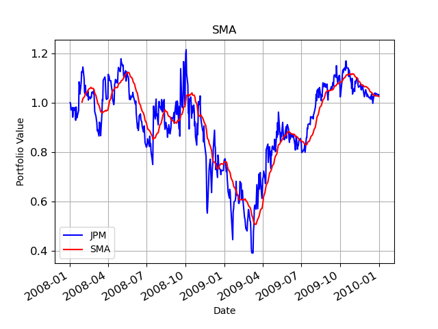
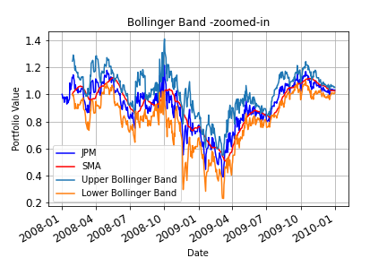
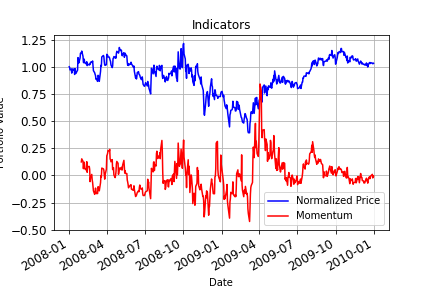
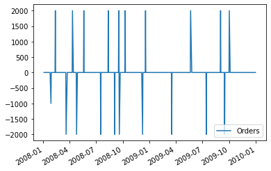
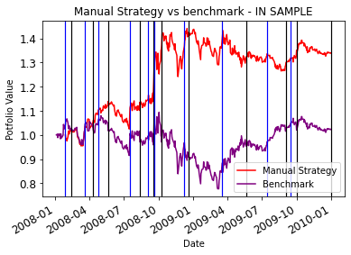
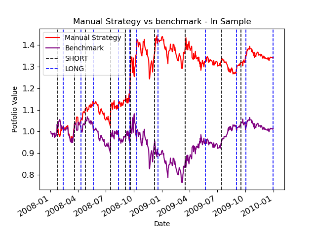
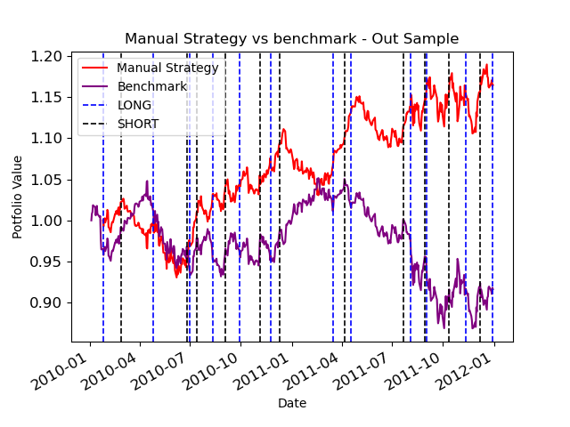

## Overview
This project performs technical analysis on stock market data of US stock market. It answers the standard question ; Can we beat the stock market by taking intelligent positions to maximize the profits? For improving the profits it uses 3 types of market indicators to define LONG and SHORT trading rules. This project is built using Python3, Pandas and Numpy and utilizes some hidden code modules like Market Simulation whose implementation I have linked to github. The project's entire code can be found on my github repository.

## Assumptions and Pre-requisites
Following gives a description of the function of each of the imports

##### util.get_data()
Provides CSV files with stock market data for multiple stock symbols in US stock market

##### marketsimcode.marketsim()
Provides a code to simulate market. This function accepts orders which contain stock orders for a particular symbol and a particular date,
initial investment as "start_val", broker commission as "commission" and impact as "impact".

#### ManualStrategy
This is a portfolio strategy that was created by a human by looking at the indicators and fixing their value manually. This is used for comparison with the StrategyLearner performance and returns.

#### The stock symbols

The stock symbols are words which represent the stock name on US stock market. Also each of the symbols must be present inside the data folder.

#### In sample Period
The in-sample period is January 1, 2008 to December 31, 2009.

#### Out sample Period
The out-of-sample/testing period is January 1, 2010 to December 31, 2011.

#### initial amount
Starting cash is $100,000.

#### Stock Symbol
Stock symbol for testing and training: JPM
### Positions
Allowable positions are: 1000 shares long, 1000 shares short, 0 shares

## Technical Indicators

Technical Indicators are heuristics used to analyze the stock market and its trends using historical data and trading volume. These technical indicators are useful in predicting the market in the future. For this project I had used the following technical indicators.

### Simple Moving Average

It’s the rolling average for the last n days. It can help in understanding if a portfolio price will continue or if it will reverse the ongoing trend. SMA smooths the volatility of the stock and makes it easier to see the long trend of the stock. The longer the window, the smoother the prediction. An upward SMA can give a buying signal and a downward trend can give a sell signal. Following is the chart that shows SMA of the stock JPM from January 2008 to January 2010.


### Bollinger Bands
It uses SMA to create two bands above and below the SMA based on the standard deviation of the stock price. The upper bands and lower bands are 2 standard deviations +/- from the 20-day simple moving average.

Formula:

𝑈𝑝𝑝𝑒𝑟 𝐵𝑎𝑛𝑑 = 𝑆𝑀𝐴 + 2 ∗ sigma

𝐿𝑜𝑤𝑒𝑟 𝐵𝑎𝑛𝑑 = 𝑆𝑀𝐴 − 2 ∗ sigma

Where:

SMA: Simple moving average for n periods
sigma : Standard deviation from SMA

Bollinger bands tell us the boundary of a stock to change trend. If the stock price crosses the upper Bollinger band, then it’s a buy opportunity. Conversely when stock price crosses the lower Bollinger band then it’s a sell opportunity.


### Momentum

It indicates the pace with which market changes. It helps us to determine the strength of a trend. How long lasting it the trend.

Formula: 𝑀𝑜𝑚𝑒𝑛𝑡𝑢𝑚 = 𝑃 − 𝑃𝑥

Where: P = Latest price, Px = Price x number of days ago

It is used by investors to go long when there is an upward momentum and go short when there is a downward momentum.


## Manual Strategy

<Manual Strategy Introduction>
In the manual strategy I gave equal weightage to Bollinger Bands, Momentum and Simple Moving Average. I used the followings values for each of them for Buy and Sell signal. I came up with these values using brute force methods and decided to use them based on market's historical data.

**Buy Signal**

If *Bollinger Band Indicator <-0.08 AND momentum < -0.03 AND Price[t]-Simple Moving Average <-0.02*

**Sell Signal**

If *Bollinger Band Indicator >0.08 AND momentum >0.03 AND Price[t]-Simple Moving Average >0.02*;

### Why I think these are good signals?

For ***Buy Signal***, importantly all these values are negative which tell us that the daily price has gone down below normal thresholds.
- Prices less than SMA indicate that the prices are lower than normal trend n days before hence, price may bounce back.
- Momentum less than 0 indicates a Bearish trend and tells that the market is significantly down and may rise back to the old price.
- Bollinger Band index less than 0 indicates that the current price is very close to the lower Bollinger band and negatively away than SMA. Hence, it may also bounce back.
Since I use these indicators together, they create a strong buying signal.

Conversely for a ***Sell signal***,
- I check that the prices are more than SMA.
- The momentum is bullish, and market is stronger.
- Bollinger Band index greater than 0 indicates that the current price is very close to upper Bollinger band and positively away from SMA. Also, I use these indicators together, they create a strong selling signal and may result into some profits.

The actual thresholds for these signals were decided based on trial and error on JPM data for in-sample period. I chose the values that gave better results in-sample period by analyzing the in-sample data.
### Jupyter NoteBook
```python
import pandas as pd
from util import get_data
import datetime as dt
import matplotlib.pyplot as plt
import numpy as np
import marketsim
```


```python
def SMA(JPM_df,symbol,window):
    # Simple Moving Averages
    sma=JPM_df.rolling(window,center=False).mean()
    return sma

def bollinger(JPM_df,symbol,window):
    sigma=JPM_df.rolling(window,center=False).std()
    sma=JPM_df.rolling(window).mean()
    upper_bollinger_band=JPM_df+2*sigma
    lower_bollinger_band=JPM_df+(-2*sigma)
    bollinger_indicator=(JPM_df-sma)/(2*sigma)
    return upper_bollinger_band,lower_bollinger_band,bollinger_indicator

def momentum(JPM_df,symbol,window):
    # Momentum
    momentum=(JPM_df/JPM_df.shift(window))-1
    #return momentum
    return momentum
```


```python
 #using indicators SMA, Bollinger and momentum
symbol = "JPM"
sd=dt.datetime(2008,1, 4)
ed=dt.datetime(2009,12,31)
sv = 100000
window=14
symbol_df=get_data([symbol], pd.date_range(sd, ed))
symbol_df=symbol_df.drop(['SPY'],axis=1)
#NORMALIZING before
symbol_df=symbol_df.div(symbol_df.iloc[0])
sma=SMA(symbol_df,symbol,window)
upper_bollinger,lower_bollinger,bollinger_indicator=bollinger(symbol_df,symbol,window)
momentum=momentum(symbol_df,symbol,window)
ppo=PPO(symbol_df,symbol)
```
```python
dates = pd.date_range(sd, ed)
df_return=pd.DataFrame(np.nan, index=symbol_df.index, columns=['Orders'])
for i in range(symbol_df.shape[0]):
    momentum_i=momentum[symbol].iloc[i]
    sma_i=(symbol_df[symbol].iloc[i]/sma[symbol].iloc[i])-1
    bollinger_indicator_i=bollinger_indicator[symbol].iloc[i]

    if bollinger_indicator_i<-0.08 and momentum_i<-0.03 and sma_i<-0.02:
        df_return.iloc[i]=1000
    elif bollinger_indicator_i>0.8 and momentum_i>0.03 and sma_i>0.02:
        df_return.iloc[i]=-1000

df_return.ffill(inplace=True)
df_return.fillna(0, inplace=True)
trades = df_return.diff()
trades.iloc[0] = 0
trades.plot()
trades.columns=['Orders']
```


```python
#Prepare orders for marketsim.computeportvals
manual_orders = trades.copy()
manual_orders.iloc[-1] = 1

manual_orders = manual_orders[(manual_orders.Orders != 0)]
manual_orders['Symbol'] = symbol
manual_orders['Order'] = np.where(manual_orders['Orders']>0, 'BUY', 'SELL')
manual_orders['Shares'] = np.where(manual_orders['Orders']>0, manual_orders['Orders'],-manual_orders['Orders'])
manual_orders['Date'] = manual_orders.index
benchmark_orders = pd.DataFrame(data={'Symbol': [symbol,symbol],'Order': ["BUY","BUY"],
                                      'Shares': [1000,0]},
                                index={trades.index.min(), trades.index.max()})
benchmark_orders['Date']=benchmark_orders.index

print(manual_orders)
```

                Orders Symbol Order  Shares       Date
    2008-01-28 -1000.0    JPM  SELL  1000.0 2008-01-28
    2008-02-12  2000.0    JPM   BUY  2000.0 2008-02-12
    2008-03-20 -2000.0    JPM  SELL  2000.0 2008-03-20
    2008-04-11  2000.0    JPM   BUY  2000.0 2008-04-11
    2008-04-25 -2000.0    JPM  SELL  2000.0 2008-04-25
    2008-05-20  2000.0    JPM   BUY  2000.0 2008-05-20
    2008-07-17 -2000.0    JPM  SELL  2000.0 2008-07-17
    2008-08-12  2000.0    JPM   BUY  2000.0 2008-08-12
    2008-09-03 -2000.0    JPM  SELL  2000.0 2008-09-03
    2008-09-17  2000.0    JPM   BUY  2000.0 2008-09-17
    2008-09-19 -2000.0    JPM  SELL  2000.0 2008-09-19
    2008-10-09  2000.0    JPM   BUY  2000.0 2008-10-09
    2008-12-08 -2000.0    JPM  SELL  2000.0 2008-12-08
    2008-12-18  2000.0    JPM   BUY  2000.0 2008-12-18
    2009-03-18 -2000.0    JPM  SELL  2000.0 2009-03-18
    2009-05-22  2000.0    JPM   BUY  2000.0 2009-05-22
    2009-07-15 -2000.0    JPM  SELL  2000.0 2009-07-15
    2009-09-02  2000.0    JPM   BUY  2000.0 2009-09-02
    2009-09-16 -2000.0    JPM  SELL  2000.0 2009-09-16
    2009-10-02  2000.0    JPM   BUY  2000.0 2009-10-02
    2009-12-31     1.0    JPM   BUY     1.0 2009-12-31

```python
commission = 9.95
impact = 0.005
manual_strategy=marketsim.compute_portvals(manual_orders, start_val=100000, commission=commission, impact=impact)
benchmark=marketsim.compute_portvals(benchmark_orders, start_val=100000, commission=commission, impact=impact)

manual_strategy=manual_strategy/manual_strategy.iloc[0]
benchmark=benchmark/benchmark.iloc[0]
ax=manual_strategy.plot(title="Manual Strategy vs benchmark - IN SAMPLE",color="red",label="Manual Strategy")
benchmark.plot(ax=ax,label="Benchmark",color="purple")
for date,row in manual_orders.iterrows():
    if(row['Order']=='SELL'):
        plt.axvline(x = date, color = 'blue',linewidth=1.2)
    elif(row['Order']=='BUY'):
        plt.axvline(x = date, color = 'black',linewidth=1.2)
ax.legend()
plt.xlabel("Date")
plt.ylabel("Potfolio Value")
plt.yticks(fontsize=12)
plt.xticks(fontsize=12)
plt.plot()
```


```python
#cm_ret
#stdd_ret
#md_ret
print("Cumulutive Returns :",manual_strategy[-1],benchmark[-1])
print("STD of Daily Returns: ",(manual_strategy/manual_strategy.shift(1)).std(),
      (benchmark/benchmark.shift(1)).std())
print("Mean Daily Returns:",(manual_strategy/manual_strategy.shift(1)).mean(),
      (benchmark/benchmark.shift(1)).mean())
```
    Cumulutive Returns : 1.339561580121506 1.0236469899823053
    STD of Daily Returns:  0.012724349247932745 0.016862958718808954
    Mean Daily Returns: 1.0006809669682883 1.000188013978937

### Results
Below are the charts for in sample and out sample data comparing manual and benchmark strategies for JPM stock. Before the market dips it takes a SHORT position and LONG position before market peaks. The blue and black vertical lines in the chart indicate LONG and SHORT positions.
Benchmark is the Actual JPM stock price for the specified duration.
As you can see that my Manual Strategy works better than the benchmark using the above values for Stock indicators. However for Out-sample period it fairly improves the returns.


### Speed of Calculation
Manual Strategies are calculated by considering the historical data of the stock prices, thats what technical analysis means. However considering large portion of historical data and making decisions is not always faster for a human. Humans are good at fundamental analysis in which we can assess the portfolio of stocks by considering the market conditions and company details. Hence Technical analysis can be easily achieved by machines which are capable of processing large chunks of data in no time.
In the next blog I will be explaining how I trained a Random Forest to predict the stock market and achieve better portfolio returns in less time.
##
